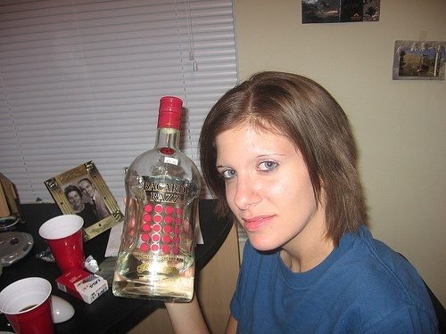
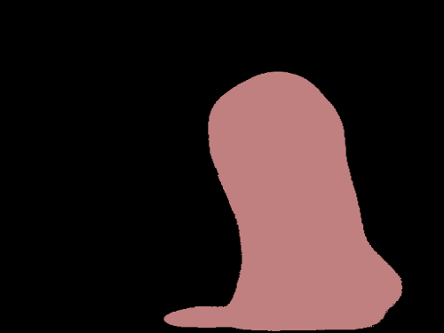

# ONNX-TensorRT

# Yolov5(4.0)/Yolov5(5.0)/YoloR/YoloX/Yolov4/Yolov3/CenterNet/CenterFace/RetinaFace/Classify/Unet Implementation

Yolov4/Yolov3/Yolov5/yolor/YoloX

- 
-  

centernet

Unet

              

CenterFace

              

retinaface

## INTRODUCTION

you have the trained model file from the darknet/libtorch/pytorch/mxnet

- [x] yolov5-4.0(5s/5m/5s/5x)
- [x] yolov5-5.0(5s/5m/5s/5x)
- [x] yolov4 , yolov4-tiny
- [x] yolov3 , yolov3-tiny
- [x] yolor
- [x] YoloX
- [x] centernet
- [x] Unet
- [x] CenterFace
- [x] RetinaFace
- [x] classify(mnist\alexnet\resnet18\resnet34\resnet50\shufflenet_v2\mobilenet_v2)

## Features

- [x] inequal net width and height

- [x] batch inference

  ------

  onnx-tensorrt batch inference : onnx re-export(batch:2)

- [x] support FP32(m_config.mode = 0),FP16(m_config.mode = 1),INT8(m_config.mode = 2)

- [x] dynamic input size(tiny_tensorrt_dyn_onnx)

<b>BENCHMARK</b>

#### window x64 (detect time)

|      model      |  size   |  gpu   |  fp32   |  fp16   |  INT8   | GPU(MB)(FP32/FP16/INT8) |
| :-------------: | :-----: | :----: | :-----: | :-----: | :-----: | :---------------------: |
|     yolov3      | 608x608 | 2080ti | 28.14ms | 19.79ms | 18.53ms |      1382/945/778       |
|     yolov4      | 320x320 | 2080ti | 8.85ms  | 6.62ms  | 6.33ms  |      1130/1075/961      |
|     yolov4      | 416x416 | 2080ti | 12.19ms | 10.20ms | 9.35ms  |     1740/1193/1066      |
|     yolov4      | 512x512 | 2080ti | 15.63ms | 12.66ms | 12.19ms |     1960/1251/1218      |
|     yolov4      | 608x608 | 2080ti | 24.39ms | 17.54ms | 17.24ms |     1448/1180/1128      |
|     yolov4      | 320x320 |  3070  | 9.70ms  | 7.30ms  | 6.37ms  |     1393/1366/1238      |
|     yolov4      | 416x416 |  3070  | 14.08ms | 9.80ms  | 9.70ms  |     1429/1394/1266      |
|     yolov4      | 512x512 |  3070  | 18.87ms | 13.51ms | 13.51ms |     1485/1436/1299      |
|     yolov4      | 608x608 |  3070  | 28.57ms | 19.60ms | 18.52ms |     1508/1483/1326      |
|     yolov4      | 320x320 |  1070  | 18.52ms |    \    | 12.82ms |        686/\/442        |
|     yolov4      | 416x416 |  1070  | 27.03ms |    \    | 20.83ms |       1480/\/477        |
|     yolov4      | 512x512 |  1070  | 34.48ms |    \    | 27.03ms |       1546/\/515        |
|     yolov4      | 608x608 |  1070  |  50ms   |    \    | 35.71ms |       1272/\/584        |
|     yolov4      | 320x320 | 1660TI | 16.39ms | 11.90ms | 10.20ms |      1034/863/787       |
|     yolov4      | 416x416 | 1660TI | 23.25ms | 17.24ms | 13.70ms |      1675/1227/816      |
|     yolov4      | 512x512 | 1660TI | 29.41ms | 24.39ms | 21.27ms |      1906/1322/843      |
|     yolov4      | 608x608 | 1660TI | 43.48ms | 34.48ms | 26.32ms |      1445/1100/950      |
|    yolov5 5s    | 640x640 | 2080ti | 24.47ms | 22.46ms | 22.38ms |       720/666/652       |
|    yolov5 5m    | 640x640 | 2080ti | 30.61ms | 24.02ms | 23.73ms |       851/728/679       |
|    yolov5 5l    | 640x640 | 2080ti | 32.58ms | 25.84ms | 24.44ms |      1154/834/738       |
|    yolov5 5x    | 640x640 | 2080ti | 40.69ms | 29.81ms | 27.19ms |      1530/1001/827      |
|   yolor_csp_x   | 512x512 | 2080ti | 27.89ms | 20.54ms | 18.71ms |      2373/1060/853      |
|    yolor_csp    | 512x512 | 2080ti | 21.30ms | 18.06ms | 17.03ms |      1720/856/763       |
|   YOLOX-Nano    | 416x416 | 2080ti | 6.84ms  | 6.81ms  | 6.69ms  |       795/782/780       |
|   YOLOX-Tiny    | 416x416 | 2080ti | 7.86ms  | 7.13ms  | 6.73ms  |       823/798/790       |
|     YOLOX-S     | 640x640 | 2080ti | 19.51ms | 16.62ms | 16.33ms |       940/836/794       |
|     YOLOX-M     | 640x640 | 2080ti | 23.35ms | 18.67ms | 17.87ms |       919/716/684       |
|     YOLOX-L     | 640x640 | 2080ti | 28.25ms | 20.36ms | 19.24ms |      1410/855/769       |
| YOLOX-Darknet53 | 640x640 | 2080ti | 29.95ms | 20.38ms | 18.91ms |      1552/928/772       |
|     YOLOX-X     | 640x640 | 2080ti | 40.40ms | 22.95ms | 21.99ms |     1691/1187/1020      |
|    darknet53    | 224*224 | 2080ti | 3.53ms  | 1.84ms  | 1.71ms  |      1005/769/658       |
|    darknet53    | 224*224 |  3070  | 4.29ms  | 2.16ms  | 1.75ms  |      1227/1017/951      |
|  resnet18-v2-7  | 224*224 | 2080ti | 1.89ms  | 1.29ms  | 1.18ms  |       878/655/624       |
|      unet       | 512*512 | 2080ti | 20.91ms | 17.01ms | 16.05ms |      1334/766/744       |
| retinaface_r50  | 512x512 | 2080ti | 12.33ms | 8.96ms  | 8.22ms  |      1189/745/678       |
|     mnet.25     | 512x512 | 2080ti | 6.90ms  | 6.32ms  | 6.23ms  |       782/603/615       |

#### x64(inference / detect time)

|        model        |  size   |  gpu   | fp32(inference/detect) | fp16(inference/detect) | INT8(inference/detect) | GPU(MB)(FP32/FP16/INT8) |
| :-----------------: | :-----: | :----: | :--------------------: | :--------------------: | :--------------------: | :---------------------: |
|      centernet      | 512x512 | 2080ti |     17.8ms/39.7ms      |     15.7ms/36.49ms     |    14.37ms/36.34ms     |     1839/1567/1563      |
|     centerface      | 640x640 | 2080ti |     5.56ms/11.79ms     |     4.23ms/10.89ms     |           /            |       854/646/640       |
| centerface_bnmerged | 640x640 | 2080ti |     5.67ms/11.82ms     |     4.22ms/10.46ms     |           /            |       850/651/645       |

## windows10

- dependency : spdlog，onnx，onnx-tensorrt，protobuf-3.11.4，TensorRT 7.2.2.3  , cuda 11.1 , cudnn 8.0  , opencv3.4, vs2019

- build:

    open MSVC _tiny_tensorrt_onnx.sln_ file 

    tiny_tensorrt_dyn_onnx:dynamic shape 

    tiny_tensorrt_onnx: normal

- build onnx-tensorrt

    step1: https://github.com/onnx/onnx-tensorrt.git

    step2: https://drive.google.com/drive/folders/1DndiqyCZ796p3-xXI3O4AMCIGcUWQ1q2?usp=sharing or https://share.weiyun.com/CJCwngAM

    step3: **builtin_op_importers.cpp** replace onnx-tensorrt\builtin_op_importers.cpp

    step4: tortoiseGit->apply patch serial and choose **0001-Compile-onnx-tensorrt-by-MSVC-on-Windows.patch**

    step5:build onnx.lib\onnx_proto.lib\nvonnxparser.dll\nvonnxparser_static.lib

## Model and 3rdparty

model : https://drive.google.com/drive/folders/1KzBjmCOG9ghcq9L6-iqfz6QwBQq6Hl4_?usp=sharing or https://share.weiyun.com/td9CRDhW

3rdparty:https://drive.google.com/drive/folders/1SddUgQ5kGlv6dDGPqnVWZxgCoBY85rM2?usp=sharing or https://share.weiyun.com/WEZ3TGtb

## API

	struct Config
	{
	    std::string cfgFile = "configs/yolov3.cfg";
	
	    std::string onnxModelpath = "configs/yolov3.onnx";
	
	    std::string engineFile = "configs/yolov3.engine";
	
	    std::string calibration_image_list_file = "configs/images/";
	
	    std::vector<std::string> customOutput;
	
	    int calibration_width = 0;
	
	    int calibration_height = 0;
	    
	    int maxBatchSize = 1;
	
	    int mode; //0，1，2
	
	    //std::string calibration_image_list_file_txt = "configs/calibration_images.txt";
	};
	
	class YoloDectector
	{
	void init(Config config);
	void detect(const std::vector<cv::Mat>& vec_image,
		std::vector<BatchResult>& vec_batch_result);
	}

## REFERENCE

https://github.com/onnx/onnx-tensorrt.git

https://github.com/NVIDIA/TensorRT/tree/master/samples/opensource/sampleDynamicReshape

https://github.com/NVIDIA-AI-IOT/deepstream_reference_apps

https://github.com/enazoe/yolo-tensorrt.git

https://github.com/zerollzeng/tiny-tensorrt.git
## Contact

