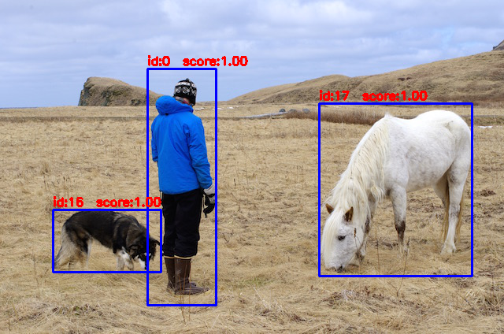
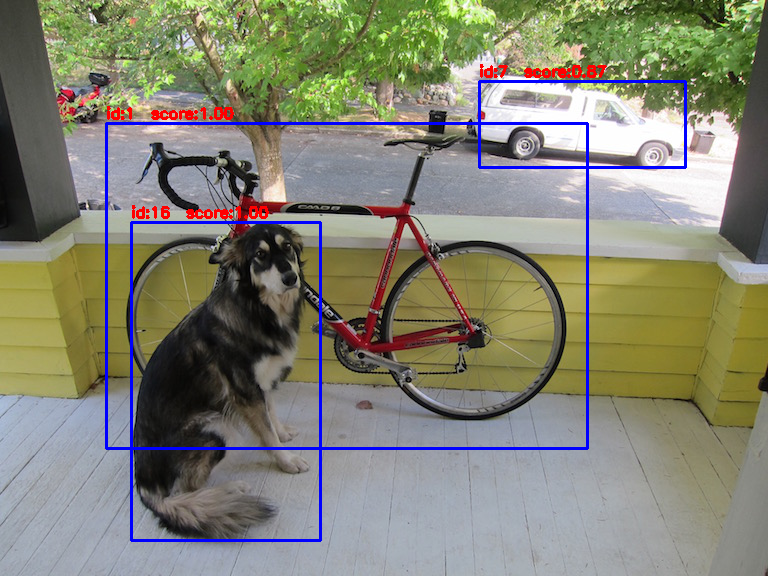
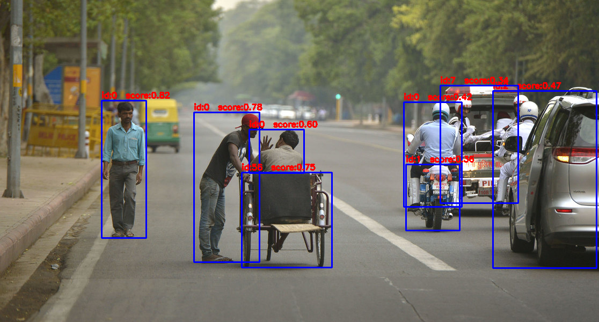
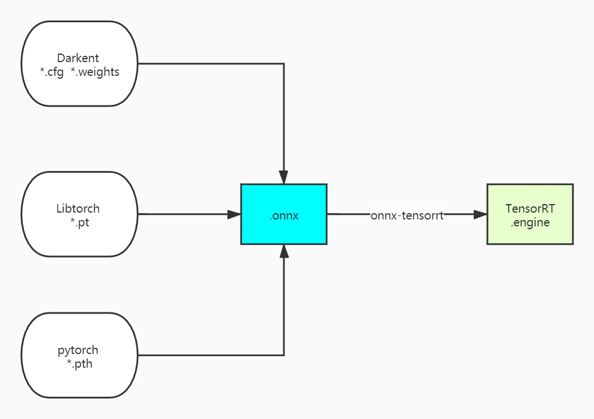

# ONNX-TensorRT

# Yolov4/Yolov3/CenterNet/Classify/Unet Implementation

Yolov4/Yolov3

- 
-  

centernet

## INTRODUCTION

you have the trained model file from the darknet/libtorch/pytorch

- [x] yolov4 , yolov4-tiny
- [x] yolov3 , yolov3-tiny
- [x] centernet
- [x] classify(mnist\alexnet\resnet18\resnet34\resnet50\shufflenet_v2\mobilenet_v2)

## Features

- [x] inequal net width and height
- [x] batch inference
- [x] support FP32,FP16,INT8
- [x] dynamic input size(tiny_tensorrt_dyn_onnx)

## windows10

- dependency : spdlog，onnx，onnx-tensorrt，protobuf-3.11.4，TensorRT 7.2.2.3  , cuda 11.1 , cudnn 8.0  , opencv3.4, vs2019

- build:

    open MSVC _tiny_tensorrt_onnx.sln_ file 

    tiny_tensorrt_dyn_onnx:dynamic shape 

    tiny_tensorrt_onnx: normal

- build onnx-tensorrt

    step1: https://github.com/onnx/onnx-tensorrt.git

    step2: https://drive.google.com/drive/folders/1DndiqyCZ796p3-xXI3O4AMCIGcUWQ1q2?usp=sharing

    step3: **builtin_op_importers.cpp** replace onnx-tensorrt\builtin_op_importers.cpp

    step4: tortoiseGit->apply patch serial and choose **0001-Compile-onnx-tensorrt-by-MSVC-on-Windows.patch**

    step5:build onnx.lib\onnx_proto.lib\nvonnxparser.dll\nvonnxparser_static.lib

## Model and 3rdparty

model : https://drive.google.com/drive/folders/1KzBjmCOG9ghcq9L6-iqfz6QwBQq6Hl4_?usp=sharing

3rdparty:https://drive.google.com/drive/folders/1SddUgQ5kGlv6dDGPqnVWZxgCoBY85rM2?usp=sharing

## API

	struct Config
	{
	    std::string cfgFile = "configs/yolov3.cfg";
	
	    std::string onnxModelpath = "configs/yolov3.onnx";
	
	    std::string engineFile = "configs/yolov3.engine";
	
	    std::string calibration_image_list_file = "configs/images/";
	
	    std::vector<std::string> customOutput;
	
	    int calibration_width = 0;
	
	    int calibration_height = 0;
	    
	    int maxBatchSize = 1;
	
	    int mode; //0，1，2
	
	    //std::string calibration_image_list_file_txt = "configs/calibration_images.txt";
	};
	
	class YoloDectector
	{
	void init(Config config);
	void detect(const std::vector<cv::Mat>& vec_image,
		std::vector<BatchResult>& vec_batch_result);
	}

## REFERENCE

https://github.com/onnx/onnx-tensorrt.git

https://github.com/NVIDIA/TensorRT/tree/master/samples/opensource/sampleDynamicReshape

https://github.com/NVIDIA-AI-IOT/deepstream_reference_apps

https://github.com/enazoe/yolo-tensorrt.git

https://github.com/zerollzeng/tiny-tensorrt.git
## Contact

